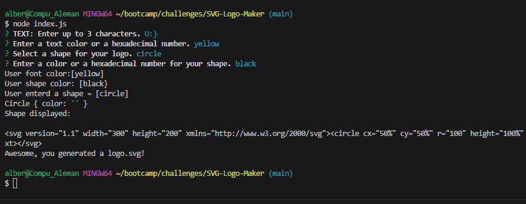

# SVG-Logo-Maker
Albert Aleman
  Github Ripository: https://github.com/aalemanyz67/SVG-Logo-Maker, 
video link: https://drive.google.com/file/d/1xeclKHncafBdJIoGV4yWOlMIFTS4Homo/view

# Objective:
Using Node.js create an application that will generate a logo for the user. This app will be initialized using the terminal command line. 

# Description
Using Node.js, user will have the ability to generate a logo using the terminal command line. User will answer prompt questions to generate their logo. User will aslo have the ability to run tests so that they can see if their shape will generate correctly. This app was built using the skills I have learned so far in this bootcamp. Throughout this challenge I learned how to incorporate skills such as tests, rendering, writeToFile, extend and how to generate text into shapes and shapes into logos.

# Installation
In order for this application to work properly the following must be done. Ensure you are using VS Code to open up the application. 2. Once opened, select the index.js file  and right click. 3. select the "open in intergrated terminal" feature. 4. Insure that your system is ready to go by typing "npm i" to make sure you have the needed packages. 5. After confirming you have the needed packages, type "node index.js" and follow the pormpted question in the terminal. 6. Finally when all prompts have been filled the application will generate the new logo. 7. The new logo will be found under the "logo.svg" file. Once there you can open it on a browser or live server. 8. The user can save their logo by creating a new file in the examples folder and coping the data into it. 

## Runing Tests
In this application you can also run tests for the shapes to ensure that they will render correctly. To do this right click on the shapes.test.js file and select open in terminal. Next, type in "npm test" and the test will begin. If there is any error with how your shapes will render, the test will notify you.

# Usage and Screen Shots
 This application can be used to generate a new logo that will display a shape (circle, square, or triangle), background color, and text color. Below are screenshots of how my application works.

 Running shape.test.js to ensure my shapes will render. 

 Starting up application using node index.js

Prompt questions and answers.

New logo generated in logo.svg file

Logo displayed in browser.

# Collaborators and Resources
 Collaborators:
 Bootcamp tutor : Andrew Hardemon 
    --Andrew assisted in helping me run the correct tests and troubleshoot issues I had in my index.js file.
Resources: 
w3schools: https://www.w3schools.com/
Mozilla Documentation for keyword "extends" https://developer.mozilla.org/en-US/docs/Web/JavaScript/Reference/Classes/extends

# License: MIT
https://choosealicense.com/licenses/mit/

